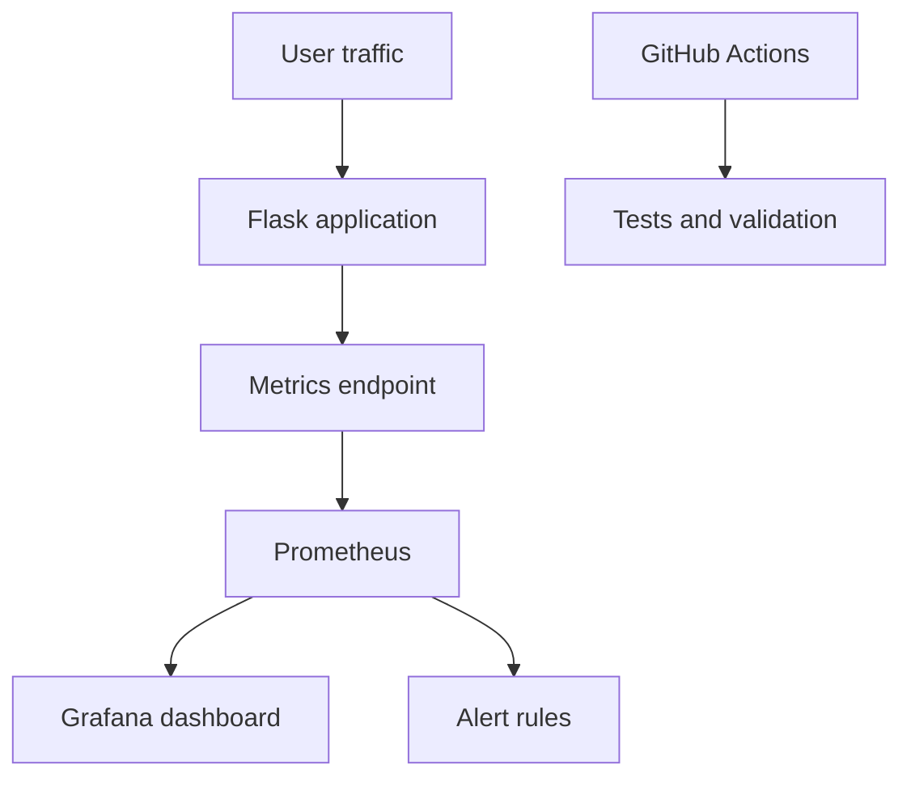

# Cloud Monitoring with Prometheus and Grafana

[](https://github.com/ummadisettisindhuja2-netizen/cloud-monitoring-prometheus-grafana/actions/workflows/monitoring-ci.yml)

A containerized observability project that monitors a Python Flask application using Prometheus and Grafana. It collects application metrics, visualizes performance, evaluates alert rules and validates the complete stack through GitHub Actions.

## Architecture



## Features

- Flask application with health and Prometheus metrics endpoints
- HTTP request counter and response-time histogram
- Prometheus metric collection every 15 seconds
- Grafana data source and dashboard auto-provisioning
- Application availability and latency alert rules
- Docker Compose orchestration
- Non-root application container
- Automated testing and security scanning
- YAML, JSON, Prometheus and Docker configuration validation

## Dashboard Metrics

The provisioned Grafana dashboard displays:

- Application request rate
- 95th-percentile response time
- Application availability
- Total HTTP requests

## Alert Rules

- `ApplicationDown` – fires when Prometheus cannot scrape the application for one minute
- `HighRequestLatency` – fires when 95th-percentile latency exceeds 0.5 seconds for two minutes

## Project Structure

```text
.
├── .github/workflows/monitoring-ci.yml
├── grafana
│   ├── dashboards/application-dashboard.json
│   └── provisioning
│       ├── dashboards/dashboards.yml
│       └── datasources/datasource.yml
├── prometheus
│   ├── alert-rules.yml
│   └── prometheus.yml
├── tests/test_app.py
├── app.py
├── Dockerfile
├── docker-compose.yml
├── requirements.txt
└── requirements-dev.txt
```

## Run Locally

Docker Desktop and Docker Compose are required.

```bash
docker compose up --build -d
```

Open:

- Application: `http://localhost:5000`
- Health check: `http://localhost:5000/health`
- Metrics: `http://localhost:5000/metrics`
- Prometheus: `http://localhost:9090`
- Grafana: `http://localhost:3000`

Default local Grafana credentials:

```text
Username: admin
Password: change-me-before-use
```

Use environment variables to provide different credentials:

```bash
GRAFANA_ADMIN_USER=admin GRAFANA_ADMIN_PASSWORD=your-secure-password docker compose up --build -d
```

Stop the stack:

```bash
docker compose down
```

## Automated Validation

GitHub Actions automatically:

1. Installs application and testing dependencies
2. Runs Pytest tests
3. Performs a Bandit security scan
4. Validates YAML and Grafana JSON files
5. Validates the Docker Compose configuration
6. Validates Prometheus configuration and alert rules
7. Builds the application Docker image

## Security

- The application container runs as a non-root user
- Grafana user registration is disabled
- Configuration files are mounted read-only
- No credentials are committed to the repository
- Production deployments should use secrets management and restricted network access

## License

This project is licensed under the MIT License.
